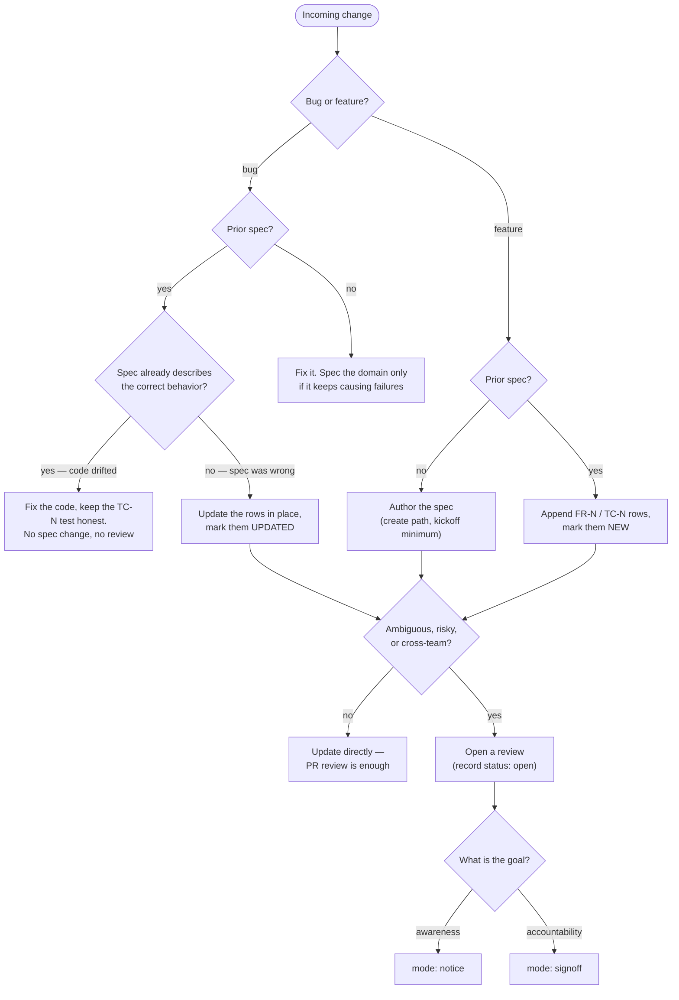

# Review & sign-off in spec.md

This document describes how a `*.spec.md` gets reviewed, acknowledged, and
signed off by the people around it — without duplicating the spec into a
second artifact that can drift.

A spec already carries *what* the system should do (`FR-N`) and *what proves
it* (`TC-N`). What it does not carry is *who* has a say and *what their say
means*. Teams usually solve this with a "sign-off sheet" that restates the
requirements for stakeholders — and that is the trap: the sheet and the spec
inevitably diverge, and the signature ends up attached to text nobody is
building from. If the spec says one thing and the sheet says another, what did
the signee actually approve?

The convention here is the opposite: **the review is a structured document
beside the spec, and everything a stakeholder reads is derived from the
spec** — crafted per audience, regenerated when the spec changes, never
maintained by hand.

---

## Two rules, everything else is style

1. **State the goal.** Every review request declares what it is for. "Getting
   sign-off" hides at least three different goals — making stakeholders
   *aware*, giving them an *opportunity for input*, or making them
   *accountable* for a decision. Each demands something different from the
   people involved, so the request must say which it is (see
   [Modes](#modes-notice-vs-signoff)).
2. **Derive, don't hand-author.** The spec is the only place content is
   *written*. What each stakeholder reads in a review is a **briefing
   generated from it** — crafted for that person's role and concerns, from
   the spec at a pinned version, citing the sections and `FR-N`/`TC-N` rows
   it summarizes. Nobody is asked to read the whole spec, and nobody is
   handed a generic section link either. Hand-maintained restatements drift;
   derived briefings are disposable — when the spec changes, regenerate
   them, the way you rebuild a binary from source. This is exactly the kind
   of projection to delegate to an agent: point it at the spec, the roles,
   and the delta.

Rule 2 presupposes there is something to derive from: **the spec exists
before the review does**, even if it is a skeletal draft. It does not have
to be finished — how much of it must exist depends on the milestone (see
[Reviewable minimums](#reviewable-minimums)). If there is nothing to derive
from yet, you are not ready for a review.

---

## When a review is warranted

**A review round is never mandatory.** It is overhead, spent only where
alignment is actually at risk. If the work is unambiguous — a bug fix that
restores specced behavior, a small requirement everyone already agrees on —
update the spec directly on your branch and let ordinary PR review carry it.
A direct update involves no record and trips no gate — the
[merge gate](#the-branch-lifecycle) only reads review records, and only when
a spec links one.

The deciding factors are not bug-versus-feature but **ambiguity** (could two
reasonable people build different things?), **blast radius** (how much code —
or how many teams — inherit a mistake?), and **stakeholder spread** (does
anyone outside the PR need to agree?). Bug or feature, with or without a
prior spec, every path funnels into that one gate:



The left half of the flow is ordinary spec upkeep — the
[update rules](./SKILL.md) already cover it. The review machinery in the rest
of this document only exists for the paths that reach `mode: notice` or
`mode: signoff`.

---

## Roles

Roles follow [DACI](https://www.atlassian.com/team-playbook/plays/daci) —
Driver, Approver, Contributors, Informed — and are declared in the review
record's frontmatter.

Each role is asked for something different — that is the point. A signature
from someone who only needed a heads-up is noise; a heads-up to someone who
should have had a veto is a gap.

| Role | Verb | What the review asks of them |
|------|------|------------------------------|
| **Driver** | *proposes* | Authors the spec, runs the review, closes it out. |
| **Approver** | *approves* | Reads their briefing (and whatever it cites), explicitly signs off. Blocking. Ideally one person. |
| **Contributors** | *review* | Domain input within a stated window. Silence past the deadline = no objection ("lazy consensus"). |
| **Informed** | *acknowledge* | Notified with a link. No signature — at most a read-receipt. |

Keep the approver list short — ideally one person. If a spec seems to need
several approvers, that is usually a sign it covers more than one decision;
consider splitting it.

---

## Spec front matter

The spec itself gains a single optional key: where its review lives. The two
documents point at each other — the spec's `review` key, the record's `spec`
key — and everything about the review, **including the approval state**,
belongs to the record. Approval is a property of the review, so that is
where it is tracked; the spec carries no status of its own.

```yaml
---
type: Spec
title: "Spec: Orders"
sources: [./src/orders]
tests: [./test/orders]
review: ./order.review.md
timestamp: 2026-07-09T14:30:00Z
---
```

| Key | Required | Purpose |
|-----|----------|---------|
| `review` | No | Spec-relative path to the review record, e.g. `./order.review.md`. The record's `spec` key points back. |

---

## The review record

The review record is the artifact stakeholders actually interact with. It is
an OKF document like the spec itself — `type: Review` — living **in the
repo, next to the spec**: `order.spec.md` gets an `order.review.md`, and the
spec's `review` key points at it. That completes the frontmatter triad:
`sources` is what implements the spec, `tests` is what proves it, `review`
is who agreed to it.

It is tempting to treat the record as knowledge-base material, but a review
is a one-time artifact: generated, signed, then load-bearing forever. Wiki
pages get reorganized, archived, and lost; a record committed beside the spec
keeps its history, survives as long as the code does, and is bound by the
commit graph to the exact version of the spec it reviewed — for free. If your
stakeholders live in Notion or Confluence, publish a read-only mirror there
(the same job `resource` does for the spec itself) and record outcomes in the
repo.

### Record frontmatter

The review's identity, participants, and state are metadata. Only `type`,
`title`, and `spec` are required.

```yaml
---
type: Review
title: "Review: Orders — pre-build signoff"
spec: ./order.spec.md
revision: a1b2c3d
mode: signoff
milestone: pre-build
status: open
driver: hank.hill@stricklandpropane.com
approvers: [buck.strickland@stricklandpropane.com]
contributors: [joe.jack@stricklandpropane.com, enrique@stricklandpropane.com]
informed: [support, sales]
deadline: 2026-07-16
resource: https://notion.com/read_only_publish_page_location
timestamp: 2026-07-09T14:30:00Z
---
```

| Key | Required | Purpose |
|-----|----------|---------|
| `type` | **Yes** | Always `Review`. |
| `title` | **Yes** | Human-readable name. |
| `spec` | **Yes** | Path to the spec under review, relative to this file. |
| `status` | No | `open`, then `approved` or `rejected`. The state the [merge gate](#the-branch-lifecycle) reads. A `notice` has nothing to approve and omits it. |
| `revision` | No | The spec commit the briefings were derived from. |
| `mode` | No | `notice` or `signoff` (see [Modes](#modes-notice-vs-signoff)). |
| `milestone` | No | `kickoff`, `pre-build`, or `pre-release`. |
| `driver` | No | Runs the review; usually the spec's author. |
| `approvers` | No | Who must explicitly sign off. Keep it to one or two. |
| `contributors` | No | Who is asked for input. People or team aliases. |
| `informed` | No | Who gets notified. Nothing is asked of them. |
| `deadline` | No | When the round closes; contributor silence past it = no objection. |
| `resource` | No | Read-only mirror in the knowledge base, if stakeholders live there. |
| `timestamp` | No | ISO 8601 of last update. |

`status: approved` does **not** freeze the spec. It records that this review
concluded; the spec keeps living.

### Record body

The body is rule 2 applied — derived, never hand-authored. It contains:

- The **goal and instructions**, stated up front.
- The **roles table** — who holds each role and what they are asked to do,
  with checkboxes for approvers only.
- A **briefing per stakeholder** — written for that person's role and
  concerns, from the spec at the pinned `revision`, citing the sections and
  `FR-N`/`TC-N` rows it summarizes so every claim is one click from its
  source. The briefing is the whole ask; the rest of the spec is context,
  not homework. Have an agent draft these — the spec, the roles, and the
  delta are all machine-readable — and regenerate them when the spec
  changes.
- The **outcome**, once the round closes.

### One record, one review

A record is **one review** — a go/no-go before the work. Most specs will
only ever have one; treat a second round as the exception, not the shape of
the file. When a spec later changes enough to warrant re-review,
**regenerate the record in place**: new `revision`, `status` back to `open`,
fresh briefings covering the delta by `FR-N`/`TC-N` id (derivable from the
spec's history — nothing is hand-copied). The old round is not lost; it is a
commit away. Git history is the archive, so the file never becomes a
changelog.

### Distribution

One record means one thing to hand out. Publish the file (or its `resource`
mirror) and drop the link in Slack — that is the entire delivery mechanism,
deliberately. The convention is validating on a manual loop first, so there
is no notification tooling to configure or maintain; if the loop proves
valuable, automate the fan-out later.

### Modes: notice vs. signoff

The mode answers rule 1 — what is this review *for?*

- **`notice`** — the goal is awareness. No signatures are collected and the
  record carries no `status` — there is nothing to approve. The record is a
  broadcast with briefings and an open invitation to comment. At most, track
  acknowledgments to learn who actually reads what you send.
- **`signoff`** — the goal is accountability. The record carries `status`
  (`open` → `approved`/`rejected`); approvers must explicitly check the box;
  contributors get an input window; the driver ships when the approvals are
  in or the deadline passes with no objections.

If you only need people to know something is happening, send a notice — do
not manufacture signatures. If someone is accountable for the outcome, they
sign against the spec itself, having read it.

### Example

```md
---
type: Review
title: "Review: Orders — pre-build signoff"
spec: ./order.spec.md
revision: a1b2c3d
mode: signoff
milestone: pre-build
status: open
driver: hank.hill@stricklandpropane.com
approvers: [buck.strickland@stricklandpropane.com]
contributors: [joe.jack@stricklandpropane.com, enrique@stricklandpropane.com]
informed: [support, sales]
deadline: 2026-07-16
---

Your briefing below is the whole ask. It was written for your role from
[the spec](./order.spec.md) at revision `a1b2c3d`, and every claim in it
cites the section or ID it came from. If it is correct and complete for
your area, check the box next to your name to record your approval. If
something is wrong or missing, comment on the spec or raise it with the
driver. We ship when every approver has signed off — contributor silence
past the deadline is taken as "no objection."

| Role | Who | Asked to | Done |
|------|-----|----------|------|
| Approver | Buck (Product) | Approve | [ ] |
| Contributor | Joe Jack (QA) | Review & comment by deadline | — |
| Contributor | Enrique (Design) | Review & comment by deadline | — |
| Informed | Support, Sales | Nothing — FYI | — |

### Briefings

**Buck (Product)** — You are approving what Orders commits to: orders are
priced from validated inputs and immutable once placed
([FR-3](./order.spec.md#functional-requirements)); adjustments go through
refund flows only, and payments and inventory stay out
([Scope](./order.spec.md#scope)).

**Joe Jack (QA)** — Acceptance is the cases in
[QA Test Cases](./order.spec.md#qa-test-cases): invalid requests are
validation errors ([TC-5]), retrieval must 404 on unknown ids ([TC-9]).
Flag anything your harness cannot assert before the deadline.

**Enrique (Design)** — Post-purchase editing is off the table: once placed,
an order can only be viewed or refunded ([FR-3]). If the confirmation flow
you are designing assumes edits, raise it now.

**Outcome:** pending — closes 2026-07-16.
```

---

## Milestones, not gates

A review can be requested at any point in a spec's life, and the record says
which point that is. The spec always exists before the review does — that is
what makes rule 2 possible — but "exists" scales with the milestone.

### Reviewable minimums

Each milestone has a reviewable minimum: the sections that must be written
for the review to mean anything, and the question the review is actually
asking.

| Milestone | The spec has at least | The review asks |
|-----------|-----------------------|-----------------|
| **Kickoff** | Frontmatter (`type`, `title`), Intro, Scope — `??` markers and gaps welcome | Are we solving the right problem, with the right boundaries? |
| **Pre-build** | + Definitions and Functional Requirements (`FR-N`); QA Test Cases for the core paths | Is this the behavior we want built? |
| **Pre-release** | + full `TC-N` coverage, `sources`/`tests` linked | Did we ship what the spec says? |

A signee at kickoff is approving boundaries, not behavior — the record's
milestone tells them which. Below the kickoff minimum there is no review to
run: if all you have is an idea, that is a conversation, not a review record.

Nothing here requires the spec to be *finished* before people are brought in —
a kickoff review of a spec that is mostly Scope and open questions is a
perfectly good review. Handoff and authoring can overlap; the milestone just
makes explicit what stage of the spec people are looking at, so nobody
unknowingly signs off on requirements that have not been written yet.

### The branch lifecycle

Because the spec and its review record are files, the review rides the same
workflow as the code:

1. The spec and its record are drafted on a **feature branch** — the record
   opens with `status: open`.
2. The review runs **on the pull request**. Approvers who live in the repo
   can sign by approving the PR; the driver checks the boxes in the record
   either way, so the record — not the platform — is the system of record.
3. The review concludes: the driver flips the record to `status: approved`
   (bumping its `timestamp`) and the PR merges. The main branch only ever
   carries approved reviews.

CI holds the gate:

```bash
npx @rosenjcb/spec-md check --require-approved
```

This fails while any spec links a review record whose `status` is not
`approved`. It is the **only** enforcement in the convention, and it is
opt-in twice over: the flag must be passed, and a spec that links no review
is not gated (nor is a `notice`, which carries no `status`). There is
deliberately no rule that invalidates a signature when a spec changes after
its review — the driver decides when re-review is warranted, and the
permanent IDs and `[NEW]`/`[UPDATED]` markers make "what changed since you
last looked" cheap to communicate without restating anything. We want a
baseline of how teams actually use reviews (how many people read,
acknowledge, comment) before hardening anything further.

---

## Checklist

- [ ] The record's frontmatter declares `type: Review`, its `spec`, `mode`,
      and `milestone`; the goal is stated up front in the body.
- [ ] The spec's `review` key and the record's `spec` key point at each
      other.
- [ ] The spec meets its milestone's reviewable minimum before the record
      goes out.
- [ ] The record pins the spec `revision` its briefings were derived from.
- [ ] Every stakeholder gets a briefing crafted for their role, citing the
      sections and IDs it summarizes — no generic section pointers, no
      hand-maintained restatements.
- [ ] One (or few) approvers; contributors have a deadline; informed are
      asked for nothing.
- [ ] A re-review regenerates the record in place — new `revision`, `status`
      back to `open`, delta by `FR-N`/`TC-N` id; git history keeps the old
      round.
- [ ] The record lives next to the spec; any knowledge-base copy is a
      mirror, not the source.

For a worked example, see [`examples/pizza-ts`](./examples/pizza-ts):
[`order.spec.md`](./examples/pizza-ts/specs/order.spec.md) links
[`order.review.md`](./examples/pizza-ts/specs/order.review.md), an approved
pre-build signoff carrying the roles, per-stakeholder briefings, and the
approval state.

### Appendix: Further reading

- Atlassian Team Playbook, DACI: https://www.atlassian.com/team-playbook/plays/daci
- MADR — Markdown Architecture Decision Records: https://adr.github.io/madr/
- PEP 1 — PEP Purpose and Guidelines: https://peps.python.org/pep-0001/
- Rust RFC final comment period: https://forge.rust-lang.org/lang/fcp.html
- DORA, Streamlining change approval: https://dora.dev/capabilities/streamlining-change-approval/
